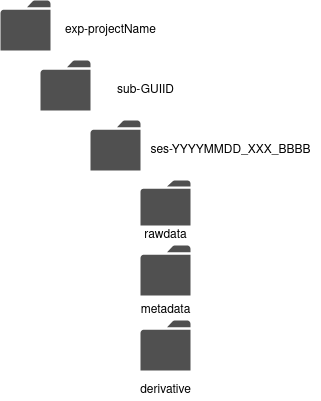

# Animal Data Organization AnDO

*Authors:
Sylvain Takerkart (sylvain.takerkart@univ-amu.fr)
Frédéric Barthélemy (frederic.barthelemy@univ-amu.fr)
Kevin Blaize (kevin.blaize@univ-amu.fr)
Jérémy Garcia (jeremy.garcia@univ-amu.fr)*

## 1. Introduction

The Animal Data Organization (AnDO) is a set of specifications for the organization of a directory containing experimental data recorded in animals. It is very inspired by the BIDS specifications ( <https://bids-specification.readthedocs.io> ). The main difference lies in the fact that in experiments conducted with animals, it is very common to have different settings for different sessions, and more importantly for different animals (whereas research on human subjects tends to have exactly the same protocol used for all subjects, as looked after by the BIDS specifications).

It follows a hierarchy of directories matched with the following concepts, as they are used in research studies conducted with animal models:

Dataset. A set of experimental data acquired for the purpose of a particular study / experiment. It is composed of data acquired in one or more animals, with one or more sessions recorded in each animal.
Subject. An animal that was included in the study.
Session. A temporal grouping of experimental data recorded in a given animal, on a given day. There can be several sessions on the same day if the recording settings are modified between sessions or if the recording needs to be interrupted and restarted.

We describe below the set of specifications themselves, as well as an application -- the AnDOChecker -- that was developed to check whether a directory given as input respects the AnDO.

## 2.Directory organization and naming

### 2.1 Dataset directory

At the top level of the hierarchy, a single directory contains all the sub-directories and files associated with a dataset, which corresponds to an experiment. It must be called:

**exp-*expName***

where:
- ‘exp-’ is an imposed prefix;
- ‘NAME’ is a string designating the name of your experiment (it can include the name of the modality if wished by the research group)

### 2.2 Subject directories

Within the top-level dataset directory, there should be one directory for each animal subject that was included in the study. Each subject directory should be called:

**sub-*guid***

where:
- ‘sub-’ is an imposed prefix;
- ‘guid’ is a string designating the Global Unique IDentifier of the animal.

No other file or directory can be present within a dataset directory.

### 2.3 Session directories

Within each subject directory, there should be one directory for each data recording session that was performed with this animal. Each session directory should be called:

**ses-*yyyymmdd_sesNumber_customSesField***

Where:
- ‘ses-’ is an imposed prefix;
- ‘yyyymmdd’ is the date of the session (6 digits, for instance 20180430 for April 30, 2018);
- ‘sesNumber’ is the number of the session acquired on that date (3 digits, for instance 001 for the first session);

- ‘customSesField’ is a string freely usable by the research group / user (for instance to add extra info on the version of the experimental protocol, on the type of preparation, on the user-friendly name of the animal etc.); this string cannot contain the underscore character.

No other file or directory can be present within a subject directory.

### 2.4 Content of the session directories

Within each session directory, three sub-directories must be present:

- ‘rawdata’. This directory must contain the raw data recorded during this session. It can consist of one or several files. For now, no naming convention / restriction are enforced on these files. Furthermore, they can be in any file format.
- ‘metadata’. This directory must gather the metadata associated with this data, both primary and secondary metadata (i.e, respectively generated automatically by the experimental setup, and generated by the experimenter). For now, no naming convention / restriction are enforced on these files. Furthermore, it can be in any file format (recommended formats are .csv, .json, .odml).
- ‘derivatives’. This directory can be used to store the data after preprocessing or processing. Its use is optional (each research group can choose to store its processed data in some other location). 

### 2.5 Exemples


- Data/exp-[project name]/sub-[GUID]/ses-yyyymmdd_sesNumber_customSesField 
- Data/exp-[project name]/sub-[GUID]/ses-yyyymmdd_sesNumber_customSesField/rawdata
- Data/exp-[project name]/sub-[GUID]/ses-yyyymmdd_sesNumber_customSesField/metadata
- Data/exp-[project name]/sub-[GUID]/ses-yyyymmdd_sesNumber_customSesField/derivatives




## 3. The AnDOChecker application

The AnDOChecker is an application that allows checking the validity of a top-level directory (experiment/dataset directory) with respect to the specifications detailed in the previous section. A command line interface (CLI) is available, as well as a web-based version which necessitates a host server.

To install the CLI, the easiest is to install the package using pip:

```bash
> pip install AnDOChecker
```
Instructions will be available soon to setup a server that can host the web-based service.

Please feel free to send us feedback and comments, or to report bugs, using the developer's page ( <https://github.com/INT-NIT/AnDOChecker> ) using the Issues section. You can also participate in ongoing discussions about the definition of a community-wide standard at <https://github.com/INCF/neuroscience-data-structure>
