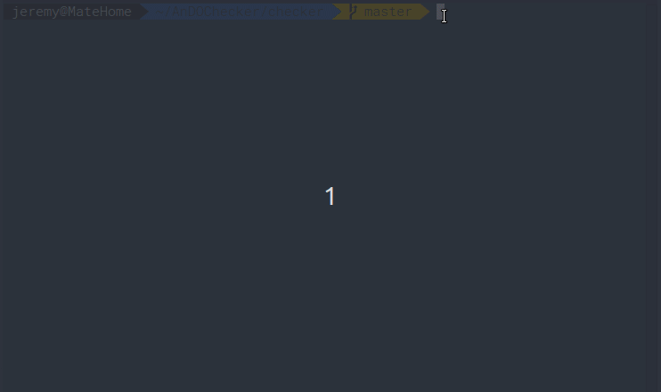
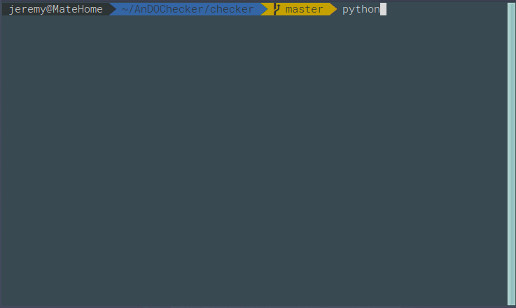

# AnDOChecker

Checks the validity of a directory with respect to the ANimal Data Organization (AnDO) specifications


[](https://pypi.python.org/pypi/ansicolortags/)[](https://shields.io/)[](https://www.python.org/)

## Table of Contents

- [AnDOChecker](#andochecker)
  - [Table of Contents](#table-of-contents)
  - [Use](#use)
    - [Clone](#clone)
    - [General usage](#general-usage)
    - [Specific usage](#specific-usage)
  - [Development](#development)
    - [Testing usage](#testing-usage)
  - [Details](#details)

## Use

### Clone

- Clone this repo to your local machine using `https://github.com/INT-NIT/AnDOChecker.git`

### General usage

```term
usage: AnDOChecker.py [-h] [-v] path

positional arguments:
  path           Path to your folder

optional arguments:
  -h, --help     show this help message and exit
  -v, --verbose  increase output verbosity

```

### Specific usage

```bash
$Python3 checker/AnDOChecker.py tests/ds001/data/Enya
```

<p align="center"></p>

OR verbose usage

```bash
$Python3 checker/AnDOChecker.py -v tests/ds001/data/Enya

```

<p align="center"></p>

## Development

### Testing usage

```bash
$cd checker/
$python3.5 -m unittest discover -v
```

## Details

In checker folder  :

- file AnDOChecker.py is the main file
- file AnDO_Error.py is the custom error exception file
- file AnDO_Engine.py is the file that verify  with the rules

In the rules folder :

- session_rules.json regex for session rules
- subject_rules.json regex for subject rules
- source_rules.json  regex for source rules
