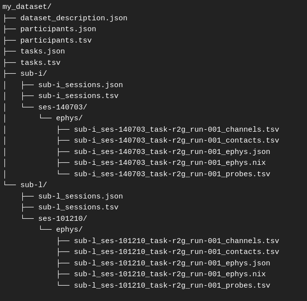

.. BEP032tools documentation master file, created by
   sphinx-quickstart on Tue Mar 30 14:48:19 2021.
   You can adapt this file completely to your liking, but it should at least
   contain the root `toctree` directive.

The BEP032 project: a repository for tools related to the BIDS-animal-ephys Extension Proposal (BEP032)
=======================================================================================================

December 2021

The BEP032tools project (previously called Animal Data Organization; AnDO) is a project initiated at the Institut de Neurosciences de la Timone, in Marseille, France, in order to set up a standardization of the experimental data recorded in animal models. Since its launch in early 2020, its aims have significantly evolved following these axes:

 - first, we have opened our desire for standardization to the community through the launch of a Working Group endorsed by the INCF; please feel free to join the group to participate in this effort: https://www.incf.org/sig/incf-working-group-standardized-data ; we are meeting approximately every two months and we are making progress in subgroups on well defined issues between each meeting;

 - second, after discussions within the group, we have initiated a specific standardization effort for electrophysiology, as a BIDS Extension Proposal ; we are actively looking for feedback from the community on this proposal, so feel free to directly comment in the document that details the data and metadata organization: https://bids.neuroimaging.io/bep032.

At this moment, this repository provides several tools, amongst them a validator (:ref:`the BEP032Validator <to_validator>`) and generator functions for user-friendly setup of an BEP032 structure. The validator complies with the latest specifications described in the BEP032 document. Please note that this validator is a temporary tool and to be used until BEP032 is officially included in BIDS. From then on the official BIDS validator will replace the BEP032Validator. We are committed to keeping the BEP032tools up to date to follow the latest modifications of the BEP032 that will occur to cope with the feedback from the community.

Example datasets
================

Here is a summarized view of an electrophysiology dataset that follows the proposed organization.

Real examples of datasets that are organized following the BEP032 rules are available on this repository: https://gin.g-node.org/NeuralEnsemble/BEP032-examples

Available tools
===============

:ref:`BEP032Validator <to_validator>`:
   - Checks the validity of a dataset with respect to the BIDS-animal-ephys BEP specifications. The specifications that define what is checked by this function is available in the following document: https://bids.neuroimaging.io/bep032

:ref:`BEP032Generator <to_generator>`:
   - Generates a BIDS-animal-ephys folder structure that follows the BEP03 specifications with a overview CSV files and optional metadata files as input. The provided framework requires project specific extension for production.

:ref:`BEP032Templater <to_templater>`:
   - Generates a dummy BEP032 structure to be manually adjusted to a project.

-----------

.. toctree::
   :maxdepth: 10
   :caption: Contents:

Indices and tables
------------------

* :ref:`genindex`
* :ref:`modindex`
* :ref:`search`
