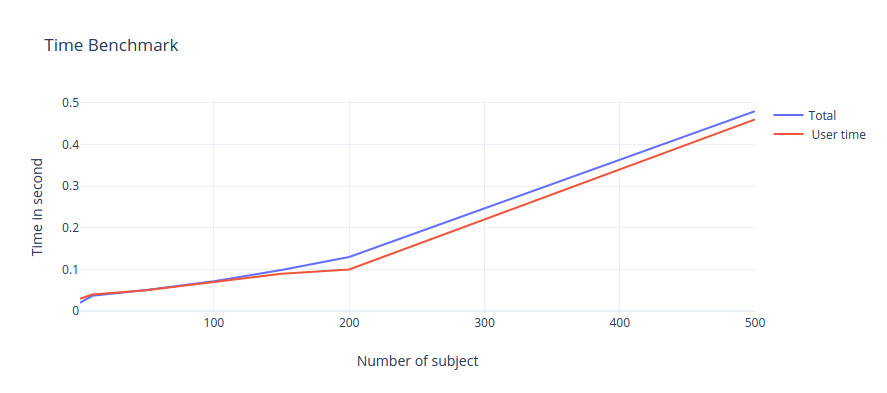

## Testing how the algorithm scales


## Objectifs 
The script "checker" should works on verry large dataset . I created a script that create a dataset with 500 subjects and 1 sessions in each subject and see how long it takes to run
# Table of Contents
0. [Objectifs](#Objectifs)
1. [Code](#code)
2. [Time benchmark](#Time-benchmark)


## Code 
Code used  to generate 500 subject

```python
import os
import random
import string
from random import randint
# create random numbre of N digits
def random_with_N_digits(n):
	range_start =  10**(n-1)
	range_end = (10**n)-1
	return randint(range_start, range_end)

try:
	for i in  range(500):
	# define the name of the directory to be created
		rdmName=''.join([random.choice(string.ascii_letters)
			  for n in  xrange(4)])
		
		rdmSpecies=random.choice(string.ascii_letters)
		rdmDate=str(random_with_N_digits(6))
		rdmNum=str(random_with_N_digits(3))

		path=os.getcwd()+"/data/exp-test/sub-"+rdmName+"/"+"sess-"+rdmDate+"_"+rdmNum+"_"+rdmSpecies+"_"+rdmName+"_test-"+rdmNum
		os.makedirs(path)

except  OSError:
	print ("Creation of the directory failed" )
else:
	print ("Successfully created the directory ")
```


## Time benchmark
-   **real** - (wall clock time) is the time from start to finish of the call. It is the time from the moment you hit the `Enter` key until the moment the command is completed.
-   **user** - amount of CPU time spent in user mode.
-   **system** - amount of CPU time spent in kernel mode


number of subject |user time| system time |total
:---|:---|:---|:---|
1| 0,03s |0,00s  |0,020s|
10| 0,04s| 0.00  | 0,037s|
50| 0,050s |0,00s  |0,051s|
100|  0,070s |  0,00s  |  0,072s|
150| 0,090s | 0,01s |0,099s|
200| 0,10s | 0,02s  |0,130s|
500|0,46s| 0,02s  |0,488s|

## Benchmark plot



we can see that the script is running well in despite the number of subject that increase
